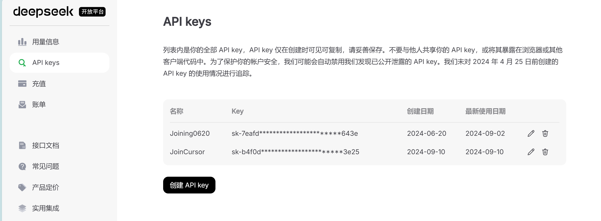

# Cursor Skill

## 如何在Cursor中配置Deepseek API

### 1. 获取api key

注册deepseek账号后，在[DeepSeek 开放平台](https://platform.deepseek.com/api_keys)中获取api key，务必小心保存，只显示一次

### 2. 配置Cursor

在File>Preferences>Cursor Settings中找到Model

如图所示将GPT系列模型全部关闭，否则后续verify会失败

 + Add model 中设置模型名为deepseek-chat或deepseek-coder(20240910，这两个模型版本都会导向deepseek-v2.5)

复制刚刚得到的deepseek api到OpenAI API Key中

将下面的Override OpenAI Base URL设置为[https://api.deepseek.com/v1](https://api.deepseek.com/v1) (不加v1也行)

verify通过即成功配置

# 如何组织中型python项目

https://github.com/InuyashaYang/mini_Pytorch

使用单元测试

Q0 明确数学问题的概念、约束和目标
输出数学符号表和约束公式表

Q1 确定代码项目应该分为哪几个大的模块，划分责能
输出项目架构和各代码文档

从输入数据集开始创建，首先明确关键节点的输入输出数据格式，再完成中间的代码组件

始终维护一个总功能文档：
记录目标、项目代码架构